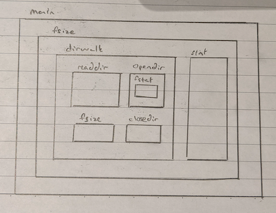

# The-C-Programming-Language-Exercises
A Repo containing my exercise solutions for "The C Programming Language" - by Brian Kernighan and Dennis Ritchie

You will find that this Repo is structured according the chapters in the book:
 - Chapter 1 (A Tutorial Introduction)
 - Chapter 2 (Types, Operators, and Expressions)
 - Chapter 3 (Control Flow)
 - Chapter 4 (Functions and Program Structure)
 - Chapert 5 (Pointers and Arrays)
 - Chapter 6 (Structures)
 - Chapter 7 (Input & Output)

# By Chapters
## Chapter 1 (A Tutorial Introduction):
> Summary: Well... as the name states. Bootstrap yourself to get started with C.
- Compiling and printing your first "hello world" + string constants (hardcoded characters enclosed in quotes " ")
- Variables and Arithmetic expressions (Temperature conversion table)
- For loops (init; condition; expression)
- Symbolic constants `#define` conducts replacement
- Character IO `getchar()` and `putchar(c)` (file copying, character counting, line counting, word counting)
- Arrays subscript operator []
- Functions callable operator () & function prototypes
- Arguments--Call by Value
- Character arrays (Strings) and `'\0'` terminator value

## Chapter 2 (Types, Operators, and Expressions):
> Summary: The basic building blocks of programs require types, operators and expressions. Types are used to define the what data object can be stored in a variable and what operations are legal. Operators specify what is to be done on variables and expressions combine variables and operators to create new values.
1. **Variable names** - lowercase for variable names and upper case for symbolic constants. underscores _ can be used to separated naming but should not be used to prefix names because it is generally reserved for internal functions/variables.
2. **Data types and sizes** - datatypes = {char, int, float, double}, qualifiers = {short, long, signed, unsigned}. More than anything, the type defines the size of memory address space that determines a range of values the type can represent. _(Read additional notes "Data types, Word sizes, Bits and Bytes")_
3. **Constants** - Constants are hard coded values just like string constants. long constants have terminal `L` and unsigned constants have terminal `U`. A ocatal constant has a leading 0(zero) and hexadecimal constant has a leading 0x. Similarly we have character constants which are represented between single aprostrophes. '0' is the int 48 and is unrelated to the numeric value 0. The null character '\0', the representation of 0 as a character constant. enumerations constants are just a faster way of defining constants without having to physcially defining everything.
4. **Declarations** - Specifies a list of variables/functions and their associated types that will be used in the program. Must be done before use of variables/functions! Declaration != Definition _(Read additional notes "Declaration vs definition?")_. Initializers must be static. An explicitly initialized variable is initialized everytime the function/block is entered. `external/static` is initializes as zero. A qualifier `const` will throw an error if the program attempts to change the value.
5. **Arithmetic operators**: include {+,-,/,*,%} associate left to right. Integer division truncates fractional part and modulus cannot be applied to float or double. 
6. **Relational and Logical operators** - relational include { <, <=, >, >= } AND equality operators { ==, != } however the former has higher precedence than the latter. Arithmetic operators have higher precedence over relational operators. Logical operators include {&&, ||}. Expressions connected by logical operators also evaluate left to right and stop as soon as truth or falsehood is determined. Arithmetic and relational operators have higher precendence over logical operators and && is higher than ||. unary ! negation operator can also come in useful at times.
7. **Type conversions** - when an operator encounters with operands with different types. Type conversion can occer where the general rule is that narrow types are converted to match the wider type. _(Read notes "Type Conversions" & "2's Complement System")_
8. **Increment and Decrement Operators** - prefix/postfix { ++/-- } operate on variables incrementing or decrementing before/after the expression is evaluated.
9. **Bitwise operators** - inlclude { &, |, ^, <<, >>, ~ }
10. **Assignment Operators and Expressions** - in most progrmaming languages the `=` is the assignment operator instead of equality. Most binary operators including { +, -, *, /, %, <<, >>, &, ^, | } can be combined with the assignment operator to shorten code.
11. **Conditional Expressions** - These are typically `if else` statements, however we can also shorten it to be more succinct if appropriate using a ternary " expr ? expr : expr" statement
- **Precedence and Order of Evaluation** - The table of order of evaluation can be found in the book pg 53. A useful quote to keep in mind taken from the book says "Writing code that depends on order of evaluation is a bad programming practive in any language". The rationale being that this can make code readability cryptic and debugging a pain.

## Chapter 3 (Control Flow)
> Summary: In this chapter, we discuss how to order execution of computations in a program.
1. **Statement and Blocks** - An expression becomes a statement when it is followed by a semicolon. The semicolon is a statement terminator and braces {} are block statement and are syntatically equivalent to a single statement.
2. **If-Else** - The else part in if-else is optional. The truth of a expression in the if (block) is determined as non-zero=true and zero=false. If you have nested if-else statements, it is wise to use block statements especially when the else keyword is used to demarcate which if condition it belongs to.
3. **Else-If** - If you want to implement a multi-way decision point, an `else if (expr)` can be used.
4. **Switch** - Like the else if keyword, switch statements can also be used in multiway decisions. They differ from else if in that they test whether a expression matches one or a number of CONSTANT integer values. Additionally, some features of the switch statement is that unless you specify the break keyword in a case to exit the switch statement. The execution falls through to below cases. Hence this may come in useful in certain scenarios. A default case may be specified to ensure all expressions are matched.
5. **Loops - While and For** - To help differentiate when to use a for loop and a while loop, if your control flow requires initialization and a repetitive routine such as incrementing a value, all this information can be conveniently placed in the for loop construct. However, choosing one over the other is a matter of personal preference. The comma operator is used to separate expressions and is evaluated left to right. **Note, the comma that separates function arguments, variables in declarations, etc, are not comma operators and do not guarantee left to right evaluation.
6. **Loops - Do-while** - In some situations you may the do while construct useful to ensure that the code block is exectuted at least once. In this construct, the condition is placed at the bottom of the block.
7. **Break and Continue** - Often times, it is handy to be able to have tighter control within looping statements to allow us to skip the rest of the code or exit from within the block. `break` exits immediately from the innermost enclosing loop. `continue` on the otherhand causes the next iteration of the enclosing for, while or do loop.
8. **Goto and Lables** - The goto statement is not particularly advisable to be used because it is never necessay. However, if anything, they can be helpful to break out of nested loops. we use a goto statement by specifying 
```
if (condition)
    goto <label>;
    ...

label:
    expr
```
the scope of the label is the entire function which makes it a dangerous tool to use often.
## Chapter 4 (Functions and Program Structure)
> Summary: functions allow us to break up our program into subroutines which are easier to test and to work with. 
1. **Basics of Functions** - a function definition contains the following. A return type, a function name, function arguments and the code block. A minimal function could be dummy(){} which does nothing but is useful as a placeholder when planning out a program structure. Programs and functions can be spread across multiple C files and must be compiled together if the main program requires functions in separate source files. _(Read additional info "Compilation steps")
2. **Functions Returning Non-integers** - So far the previous chapters only write functions that either return void or an integer. This chapter discusses about other return values. A function prototype is the function interface and function declaration. The reason why we should use function protoypes is that if not, C implicitly guesses what the function protoype from the first appearance of the function and this is potentially prone to error. By convention, we place our macros first, followed by function prototypes, followed by the main program and then the functions themselves. If a function takes no arguments, it's paramenter should be set to void.
3. **External Variables** - The idea of external variables are declaring them outside of functions so that their scope is global. The value of making variables external is that it allows them to be shared by multiple functions and does not need to be passed in as an argument. C does not allow functions to be defined within other functions unlike some more contemporary languages. [We write a postfix calculator (reverse polish notation) to show the concept of external variables in the form of a stack]
4. **Scope Rules** - Some general scoping rules are:
    -  local variables in a function do not interfere with the names of other functions that have the same name for their local varibales.
    - The scope if an external variable or a function lasts from the point at which it is declared to the end of the file being compiled.
    - If we want to refer to our external variable before they are defined or make our definitions accessible across different source files. Then we have to use the `extern` qualifier keyword.

    It is important to understand the nuance between function declaration and function definition. _(Read additional notes "Declaration vs definition?")_ in short, declaration only states what is to be used. definition reserves storage for them. There can only be one definition of external variables throughout all files that make up the source program.
5. **Header Files** - When splitting a program, we need to think about how to organize our declarations and definitions. In order to avoid the headache of going through each source file to find definitions and declarations, we can centralize these in a header file.
6. **Static Variables** - Static variables when declared globally have the effect of keeping that "external" variable private to it's source file. More interestingly, a variable within a function that is declared static is only defined once and remain in existance even after the function returns. Repeated function calls do not reinitialize its state but refer to the existing variables from the previous calls. We use `static` qualifier to declare a variable is static. 
7. **Register Variables** - If you are interested in optimising your code, using register variables should be considered. The `register` qualifier declares that a variable should be kept in the CPU's register for quick access. A variable can only be declared with register only if it is a local/automatic variable.
8. **Block Structure** - Within block statements as described previously in if-else conditionals, we can declare variables which are local to the block and are reinitialized everytime the block is entered. The variables within this block are unrelated to those outside of the block if the declaration was made inside the block. Using variables that were declared outside of the block can be used to maintain it's persistence throughout the function.
9. **Initialization** - External and static variables are guaranteed to be initialized to zero. Automatic/local and register variables are undefined (garbage values). An external/static variable MUST be initialized with a constant whilst automatic/register may be expressions and are not restricted unlike the former.
10. **Recursion** - C functions can be used recursively whereby a function calls itself directly or indirectly. Recursion provides no saving in storage because values are stored somewhere on the stack and nor is it faster. The benefit of using recursion is that it often makes the code much more elegent. 
11. **The C preprocessor** - We have somewhat mentioned this in "Compilation steps" in the additional notes section. The preprocessors duties are largely to expand macros. This section discusses how.
    1. _File inclusion_ - `#include` keywords are usually followed by <file> (for standard library headers) or "file" (user defined headers). These two delimiters have system specific implementation in that <> typically defines the path where the C preprocessor can find these files. Usually in usr/bin for Unic and in the case of "", the path is usually where the source program was found. The C preprocessor in effect takes those files and dumps them into the current source file.
    2. _Macro substitution_ `#define <name> <replacement text>` keywords acts as replacement text whenever 'name' is encountered. The scope of #define is from the point of it's declaration until the ent of the source file being compiled. Macro expansion is highly useful to speed up programs by preventing the overhead of function calls. Normally replacement text is to the end of the line but for long definitions, a \ can be used at the end of the line to be continued. It is also possible to define macros with arguments so that replacement text is different for different calls of the macro. (Read additional info "Pitfalls of Macro Substitution"). If you want to make sure that we are using a function and not a macro, you can use `#undef`. formal arguemtns are not expanded into quoted strings. However, by combining #argument the combination will convert the argument into a quoted string and string concatenation can be performed.
    3. _Conditional Inclusion_ - Quite often, you will encounter conditional macro inclusion with `#if, #endif, #else, #elif. To cut short this we can use `#ifndef,  #endif`

## Chapert 5 (Pointers and Arrays)
> Summary: 

## Chapter 6 (Structures)
> Summary:
- Basic structure syntax
- How to use structures in functions
- Structure arrays `struct example[10]`
- Pointers to structures and "`->`" syntax to access to members
- Self referential structures (Tree structures)
- Table lookup (Hashing and Linked list structures)
- `typedef` keyword
- `union` keyword
- Bit-fields (Used for packing objects in a single word, E.g. Defining a set of masks alternatively fields can be used which are structs that have members which are explicitly defined unsigned/signed ints and with : < bitsize >)

## Chapter 7 (Input & Output)
> Summary: 
1. **Standard input and output**: The C standard library implements a model to deal with I/O in the form of a text stream which are lines of text separated by a newline character. If the system doesn't work this way, the library makes it appear as though it does. Most systems use use indirection operators `< >` and piping `|`. It is important to understand the nuance of these two system functions. The <> in `#define <stdlib.h>` tells UNIX systems to look into /usr/include to find these header files.
2. **Formatted Output - Printf**: printf is a library function that formats input based on your specification and passes it to standard output. There is a plethora of formatting functionality built into print. It can be found on (pg 154). Most useful to know is that a minus sign `%-` means left adjustment. A number `%5` determines the minimum field width of the output (used mostly for padding). A period separates the width from the precision of the output `%.3`. 
3. **Variable-Length Argument Lists**: elipses used in function declaration indicate that the function can take a variable number of arguments. e.g. `int myfunc(int, ...)`. In order to access the variable list, the C standard library provides the type va_list in <stdarg.h>. [Exercise: minprintf]
```
#include <stdarg.h>

int myfunc(int x, ...)
{
    va_list ap;
    va_start(ap, x);    /* x is the last argument before va_list */
    
    int i = va_arg(ap, int); /* 2nd argument is the desired type */

}
```
4. **Formatted Input - Scanf**: It may also be convenient to get format specific input if you expect a certain input. Scanf works in the opposite fashion from printf whereby the input format is specified and by the user and stored into the addresses provided by the user when describing the format. [Exercise: minscanf & postfix calculator]
5. **File Access**: So far our c programs have been mainly interacting with stdin and stdout which are automatically opened and provided to us by the O.S in the form of file descriptors when the process starts. We can interact with other files by opening them with `FILE *fopen(char *name, char *mode)`. FILE is a structure which contains information about the buffer, permissions, location, etc. Always close opened files because most O.S. put limits on how many opened files a process can have simultaneously. At the same time, closing also flushes the buffer. [cat example]
6. **Error Handling - Stderr and Exit**: There is a third file descriptor provided by the O.S. which is stderr. Stderr is connected to your screen but can be redirected into log files instead. The reason for this is to separate your errors from your output. Instead of using return statements, more complex programs can benefit from using `exit(expr)`. Whilst this is semantically the same as `return expr` in "main", using the exit function however has the benefit that it can be called from other functions and terminates the entire program. Conventionally, exit status's of 0 means it normal termination wheras non-zero is abnormal status's
7. **Line Input and Output** - The standard library implements a similar function to `getline` known as `gets` except it reads from a stream. Take note that library functions with "f___" are equivalent to those without. The f portion just allows you to specify which file or stream to take input or channel output. Those without the f generally either take from stdin write to stdout. It is useful to keep in mind that these library functions don't provide very good return values. For e.g. `fgets` returns NULL if either an error or EOF is encountered. To get over this this problem, there is an additional function provided `feof(FILE *)` and `ferror(FILE *)` that we can use to test the status of the file pointer.
8. **Miscellaneous Functions** - `ungetc` only gurantees 1 character of pushback. You can execute system programs from within c programs by using the function `system(char *s)`. The difference between calloc and malloc is that calloc initializes storage to 0.

## Chapter 8 (The Unix System Interface):
Summary : In order to allow our programs to gain access to the O.S services, the Unix operating system provides a set of system functions(system calls) which can be used by user programs to gain access to system resources.
1. **File descriptors** - In Unix, everything is represented as a file. The reason for this is that it establishes a uniform way of interacting with the various resources in a machine. Generally when performing a read/write operation to a file, the file must first must be open. The O.S, is responsible for providing the file descriptor (After checking permissions, etc.) which is the entry point to manipulate the file. The file descriptor is a small non-negative integer and is analogour to the file pointer described in the standard library. We learnt that stdin, stdout and stderr are in fact the file decriptors {0,1,2} opened by the O.S. whenever a program is run. All information about the opened file is maintained by the system. The user program only interacts with the file descriptor.
2. **Low Level I/O - Read and Write** - System calls are in effect the entry point in which user programs can use the hardware of the device. Thus far we have been using standard library I/O functions such as `getchar` and `putchar` but these functions are built using system calls. I.e. getchar(), is just pre-defined the read operation on the file descriptor 0 (which corresponds to stdin, by default the keyboard) with a size of 1 byte (because a char is 1 byte). However, do take note that there are other implementations of getchar that instead take more input but buffers them and hands out the char input one at a time.
```
#include "syscalls.h"

int read(int fd, char *buf, int n)

int getchar(void)
{
    char c;

    return (read(0, &c, 1) == 1) ? (unsigned char) c : EOF)
}
// Notice how read returns an int but we expect a char. 
Since EOF is -1, to prevent sign extension (system 
automatically promoting char to an int) we explicitly cast it to an unsigned char.
```
3. **Open, Creat, Close, Unlink** - Just as mentioned when we want to read and write to files, we first have to open them. The `open` syscall is similar to fopen but instead of returning a file pointer, it returns the file descriptor or -1 if an error occured. `creat` will create a new file or rewrite old ones and set permissions specified by the perms parameter argument. There are 9 bits of permissions usr,group,others `rwxrwxrwx`. Therefore it is convenient to use an octal number to represent this. This octal number is referred to as mode. There is about a mximum of 20 file descriptors that a process is allocated. Therefore you cannot have many opened files together. Using the `close` function will break the connection between the file descriptor and the opened file to be reused for another file. The syscall `unlink(char *name)` removes the file name from the file system and corresponds to the standard library function remove. It seems like in mac OSX, syscalls are hidden from the user C programs use the standard library that builds on syscalls to do similar functionality. [Implement `cat` with system calls instead of stdio libraries]
4. **Random Access - Lseek** - Usually when read or write to a file, it happens sequentially. However, it is possible to move around a file with lseek syscall. `long lseek(int fd, long offset, int origin)` allows us to treat a file like an array. The standard libary function fseek is similar to lseek except the first argument is a `FILE *`
5. **Example - An implementation of fopen and getc** - A `FILE *` points to the `FILE` struct which contains 
    - the pointer to a buffer. 
    - a count of the number of characters left in the buffer.
    - a pointer to the next position in the buffer
    - file descriptor
    - flags describing the read/write mode and error status
So we see that libraries are just an interface for easier programming for interacting with IO and implement syscalls. On the other hand syscalls are the interface to the IO themselves. In general, within libraries functions are defined with underscores _iobuf to minimize conflict with user program names. Both `getc` and `fopen` require the function `_filbuf` which creates and fills the buffer if no buffer has been allocated or `_flushbuf` if it is full and needs to be reinitialized.
6. **Example - Listing Directories** - Sometimes we just want information about the file, not its contents. There are system calls for that. First to provide an overview of the UNIX filesystem structure. A directory is a file that contains a list of filenames and some indication of where they are located. The "location" is an index into another table called an inode list. The inode of a file is where all information about the file except its name is found. In short, the directory's file data is a table of the filenames it's holding and their inode number. The inode number is resolved with the inode list. Following that inode holds all data about that file except it's name. Following a directory file is also the same.  [`fsize` program that has similar functionality to `ls` bash command - whilst the `fsize` is system dependent, with a little tweaks, the program can be modified to work on local machines as long as we are able to see the underlying data structures used to represent directories and files.] Since the program structure is quite complex, this drawing tries to give a visual idea of what the program is doing 
7. **Example - A Storage Allocator** - The previous implementation of memory allocation in Chapter 5 was a rudimentary stack with a static large array. This has 2 problems, firstly free must be called according to LIFO order. Secondly, reserving a large array in every program might not be resource savvy. The new implementation attempts to solve these problems by using a linked-list instead. Our implementation of the struct representing the linked-list node must allow us to maintain alignment of the storage returned (Read additional notes "What is memory alignment"). `malloc` maintains a free list which is not initialised until the first call is made. The properties of the free list is that each memory block address is ordered in ascending order to allow consistent pointer arithmetic. At the end of the list, the last node wraps around to point to the starting node. On the first call, `malloc` will initialize the free list to point to itself with a size of zero. Subsequently, it will iterate through the free list until an available block is found or it wraps around. If there are no available blocks, `morecore` is called which requests from the operating system to provide more memory. The `morecore` function must also insert the new memory block into the new list carefully by calling `free`. `free` iterates through the list to find the space where the memory block is relative to the free list so that it can be inserted properly in accordance to the properties of the free list.


# Additional Notes

**What is alignment?**
- In C, we have very tight control over allocation in memory space. This is a good and bad thing. This means while we can implement programs that are resource efficient, we also must be very careful in our implementations to prevent accessing memory spaces we should not be accessing and in this case, make sure memory is aligned.
- In particular, one issue that comes up often is memory alignment. CPU's typically require that (sometimes for performance reasons) data is stored at addresses that is some multiple of 2^n.
- In Chapter 8.7. We tackle the problem of ensuring the memory alignment of memory blocks we get from the OS. To overcome this, we call memory blocks that are multiples of the linked list node that stores information about the memory block. On top of this, the linked list node is defined as a union with an instance of the most restrictive type (The largest data type). This ensures space returned by mallloc are aligned AND can hold any kind of data type.

**Unix File descriptors vs Standard lib File pointers**
- Firstly, it is important to note that system calls are an interface that allow programs to access and use hardware resources. The standard library functions are somewhat made for programmer ease of usability and therefore most of the time are wrappers for system calls.
- For handling files. The lowest entry point for C programs to access hardware is through system calls. The system call `open` returns a file descriptor to the file requested. The standard library provides the function `fopen` which essentially does the same thing except it returns a pointer to an internally defined stucture for representing files (`FILE *`).
- The `FILE` structure contains information about the file descriptor and, permissions and buffer. Probably the biggest difference from the file descriptor and `FILE` is the information stored in `FILE` is buffered whilst reading from the file descriptor will require a system call every time.

**Macro expansion vs Function calls**
- Macro expansion is generally prefered when you have a small routine instead of writing a function call. The reason for this is that extra resources are used when a function call is made such as copying values because of the pass by value property of arguments.
- On the other hand, macro expansion just copies the code during the preprossesing step so no values are copied over.
- However, most compilers today, inline their functions so it becomes analogous to macro expansion.

**What is a stream & buffer?**
- A stream is just an interface representing a sequence of bytes/data. The use of this is so we have a uniform way of interacting with data regardless of source or destination.
- The name stream can be applied almost to any kind of data transfer whether it be by keyboard input or program output or file reading or writing. Data comes in quite intuitively as a sequence of data and a stream is just a way to describe this process.
- A buffer on the other hand, is a sequence of data stored in memory.
- A stream can be put in a buffer for easier handling.

**Declaration vs definition?**
- A declaration is merely telling the program what the function returns, and its argument types. A function is usually declared before being used in another function/program by a function protype. If a function protoype is not found. The functions return and argument types are implicitly declared by the first use in the program.
- A definition is the entire function code itself including it's argument variable names and it's body.
- A definition will reserve storage space for a function whereas a declaration decribes what the properties of a function are.

**Data types, Word sizes, Bits and Bytes:**
- A word is a fixed size of data that a computer processor is able to handle as a unit. It is machine dependent such as having 32/64 bit machines that indicate the word size that it is able to process at one go
- The main 4 data types are `char(1), int(2/4), float(4), double(8)` (the bracket numbers are the number of bytes each data type reserves 1 byte = 8 bits)
- An int is either a 2/4 bytes long dependent on the machine.
- There are qualifiers such as short/long which tell compiler how to intepret the data sizes. Again a short and long is machine dependent. However the following rules apply. short <= int <= long
- There are qualifiers `signed` and `unsigned` which alters the range of values taken by the data type. E.g. a char is 8bits long which translates to 256 different representations. An unsigned char ranges from 0-255 whilst a signed char ranges from -128 - 127. In general, most datatypes are defaulted to signed.
- The processor identifies signed datatypes by using the (Twos complement method) which finds the negative representation of a binary number as the inverted bits + 1. Therefore in a 3 bit system, 2 : 010 ~ inverted = 101 -> +1 = 110 : -2

**Differences between an expression & statement:**
- Expressions include variables, operators, callables, subscritors and anything that evaluates to some value.
- Statements on the other hand are generally a collection of expressions but may also include control flow, etc. Expressions are statements but the same is not true vice versa.

**Type Conversions**:
- As a general rule of thumb, narrower types get converted to wider types. Converting in the opposite is prone to information lost but are not illegal.
- A char is just a small integer and therefore integer operations on chars are perfectly legal.
- There are different ways that different machines deal with sign extension. some may incur a negative integer and others might not. 
- Be careful when type conversions occur with unsigned and signed values. -1L < 1U because int 1U is promoted to an unsigned long. However, -1L > 1UL because -1L is converted to an unsigned long which appears as a large positive number.
- When you implicitly/explicitly cast a type to a different one, it produces a new value but the original value and it's type is unchanged.

**2's Complement System**
- The 2's complement system is designed to provide a way of having signed and unsigned representation in binary
- [sign & magnitude] For convenience, reserving the left most bit to represent the sign, 0 for + and 1 for - was initially devised. However, arithmetic with this system is not managable.
- [1's complement] Then came 1's complement which compared to sign & magnitude, produces a pyramid arrangement. However the problem with this is that we now have two representation of 0's and arithmetic would require the carry out bit to be added back into the right most bit.
- [2's complement] The 2's complement system remedies both of these problems by conducting the 1's complement and then adding 1 to the right most bit. This has the effect of shifting the values down to accomodate the last representation to be a the largest negative number of the range. However, it is vital to take note that to signal overflows, we must observe the sign bit carefully. The rule is that the carry IN to the sign bit must be the SAME as the carry OUT bit. If IN and OUT differs. This indicates an overflow. Otherwise, the carry out bit can be ignored.
- Even more magically, the 2's complement system allows sign extension simply by replicating the most significant/sign bit to any of the additonal bits that are extended to the left.
- When we are trying to extend unsigned values. We replicate only 0's to the left.

**Compilation steps**
- A C source file goes through multiple steps when it is compiled.
- The first step is preprocessing. This steps expands macros and concatenates source files together.
- The next step is assembly. This converts the source code into assembly code and are stored as .s files.
- The final step is the converting assembly code into object code/machine code. This is code that can be executed by the microprocessor and are the end products of our compilation labelled as .o files. However, you will only likely product these .o files when you compile multiple source programs together, each producing its own object file and also producing the final executable. Additionally there is the concept of statically linked or dynamically linked libraries (.so files). The difference here is that statically linked libraries are combined with the executable program during compilation and thus produces a bigger executable file. On the other hand, dynamically linked programs refer to these libraries during runtime and thus do not compile their object code with the executable program.

**Pitfalls of Macro Substitution**
- Some common mistakes that you can make with macro substitution can be quite hard to spot. in particular, it may be good advice to double check the arguements that are being expanded. For e.g.
```
#define max(A,B) ((A) > (B) ? (A) : (B))

int i = 1;
int j = 2;
max(i++, j++);  // This will not do what was expected.

// Expanding it we find:
((i++) > (j++) ? (i++) : (j++))
// We have incremented the values more than we wanted!
```
- Also we have to pay attention to the order of evaluation. For e.g.
```
#define square(x) x * x
vs
#define square(x) (x) * (x)

square(2 + 1);

//The second implementation protects us against accidently incurring wrong order of eval.
```
